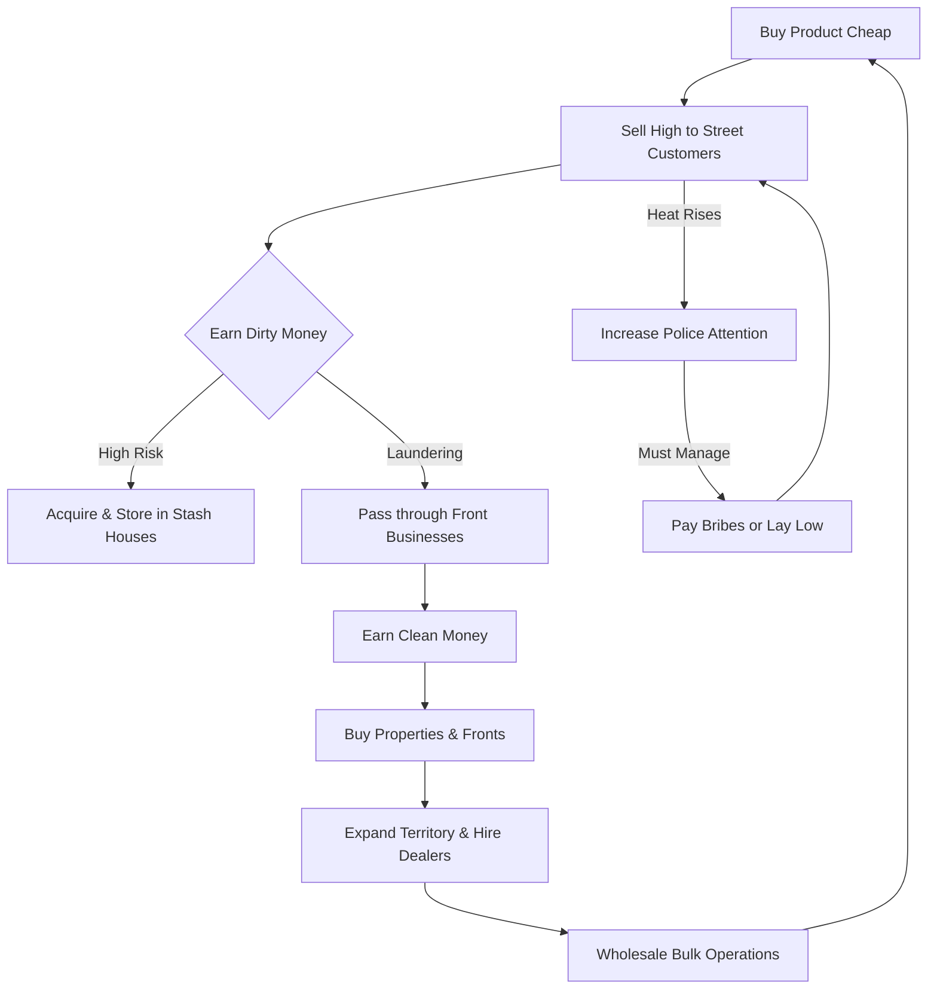

# Family Business - Core Concept & Design Pillars

This document defines the high-level vision, design pillars, and core loop of **Family Business**.

---

## 💡 Core Elevator Pitch
**Family Business** is a low-poly life simulator and empire tycoon game. The player starts as a bottom-tier street dealer, manually buying products cheap and selling them high in different territories. As they make money and gain influence, they buy better clothes, cars, houses, stash houses, and legitimate front businesses to launder their dirty cash. The game gradually shifts from a third-person real-time life sim/hustle game into a strategic management game where players hire their own dealers, buy in wholesale bulk, and manage entire city districts, all while managing the rising Heat from law enforcement.

---

## 🎨 Art Style & Aesthetic
* **Low-Poly Art Direction**: Stylized, clean, and vibrant 3D environments. This choice keeps asset creation scalable and performance high, while lending the game a signature aesthetic reminiscent of classic arcade games but with modern lighting and shaders.
* **Atmospheric Contrast**: The visual vibe shifts from gritty, run-down back alleys (early game) to flashy, neon-lit high-end clubs and penthouses (late game).

---

## 🏛️ Design Pillars

### 1. From Street to Suites (Progression Shift)
The gameplay evolution is physical and mechanical. The player starts on foot, carrying limited product and physical cash, evading police using traversal mechanics. By the end-game, the player sits in a high-end office, managing a laptop interface, reviewing balance sheets, and directing crews of dealers through automated systems.

### 2. High Heat, High Stakes
Every action has an equal reaction from the authorities. Selling product, expanding territory, and flashing wealth increases local territory and personal Heat. The player must balance greed against survival, deciding when to lay low, move operations, or invest in costly laundering fronts.

### 3. Financial Realism (Clean vs. Dirty Cash)
Cash isn't just a single number in the UI. Money exists in two distinct states:
* **Dirty Money**: Physical, vulnerable, and illegal. Used to buy drugs, pay bribes, and purchase street-level assets. Carrying too much is high risk.
* **Clean Money**: Banked, taxed, and legitimate. Used to buy real estate, front businesses, and permanent upgrades. Laundering dirty money is the primary gate to progression.

---

## 🔄 Core Gameplay Loop

### The Three Phases of Gameplay

1. **The Street Phase (The Hustler)**:
   * Focus: Manual transaction, physical survival, avoiding police using GASP traversal (vaulting, sliding, climbing).
   * Goal: Gather enough dirty cash to buy your first stash house and secure product streams.

2. **The Business Phase (The Operator)**:
   * Focus: Territory acquisition, establishing front businesses (laundromats, car washes), buying cars/clothes to boost Aura, and managing local heat.
   * Goal: Establish a stable money-laundering pipeline and transition dirty cash into clean capital.

3. **The Kingpin Phase (The Executive)**:
   * Focus: Hiring street dealers to work territories, purchasing bulk supply from wholesalers, dealing with high-level police heat, and buying high-end real estate.
   * Goal: Monopolize the city's economy and maintain absolute territory control.
