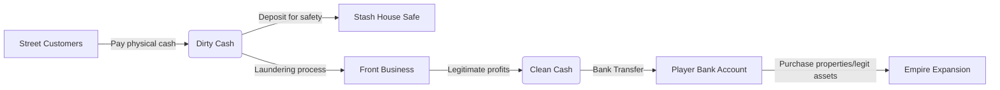

# Family Business - Money & Economy System

This document outlines the design architecture of the dual-currency system in **Family Business**: **Dirty Money** and **Clean Money**. It details the mechanics of storage, risk, and laundering pipelines.

---

## 💵 The Dual-Currency Pipeline

To create an authentic street-to-kingpin tycoon progression, money is split into two distinct states. The core game progression centers on moving cash through the laundering pipeline.

---

## 🏦 Currency Comparison

| Characteristic | 🔴 Dirty Cash (Physical) | 🟢 Clean Cash (Banked) |
| :--- | :--- | :--- |
| **State** | Physical bills carried on-player or stored in safes. | Digital currency held securely in player bank account. |
| **Source** | Street deals, protection rackets, looting rivals. | Laundered cash from front businesses, legal investments. |
| **Use Cases** | Buying raw product, bribing police, hiring street thugs. | Purchasing properties, vehicle upgrades, front businesses. |
| **Risk Profile** | **High Risk**: Dropped on death, confiscated upon arrest, stolen if a stash house is raided. | **Zero Risk**: Completely safe from police confiscation or theft. |

---

## 💼 Money Storage & Risk Mechanics

### 1. Player Wallet vs. Physical Storage
* **On-Person Wallet**: The player can carry both Clean and Dirty money on their person.
  * **Clean Money** is stored on a digital debit card. It is safe even if the player is arrested.
  * **Dirty Money** is a physical stack of bills in the player's pocket. It occupies inventory slots/weight, increases suspicion if searched, and is completely lost upon arrest or death.
* **Stash House Safes**: Safes inside safe houses are the primary storage for large amounts of physical Dirty Cash before it is laundered.
  * If the territory Heat reaches 100%, police may execute a search warrant on your stash house, seizing any cash stored in the safe if you don't defend it or move it in time.

---

## 🧼 Money Laundering Mechanics

Money laundering is the main system that transitions the player from street dealer to corporate kingpin.

### 1. Front Businesses
Players can buy legitimate businesses (e.g., Laundromat, Car Wash, Taxi Service, Nightclub) using Clean Cash.
* **Cleaning Capacity**: Each business has a maximum laundering rate (e.g., cleans $500 of dirty cash per in-game hour).
* **Cash Drops**: The player must physically transport suitcases of Dirty Cash from their stash houses to the front businesses.
* **Audit Risk**: Depositing too much dirty cash at once, or having a business's cleaning rate exceed its logical size, raises the local territory Heat and risks a tax audit (freezing the business).

### 2. The Clean Flow
Once dirty money is processed through a front business, it is auto-deposited into the player's bank account as **Clean Cash** (minus a minor laundering tax/percentage depending on the business efficiency).
