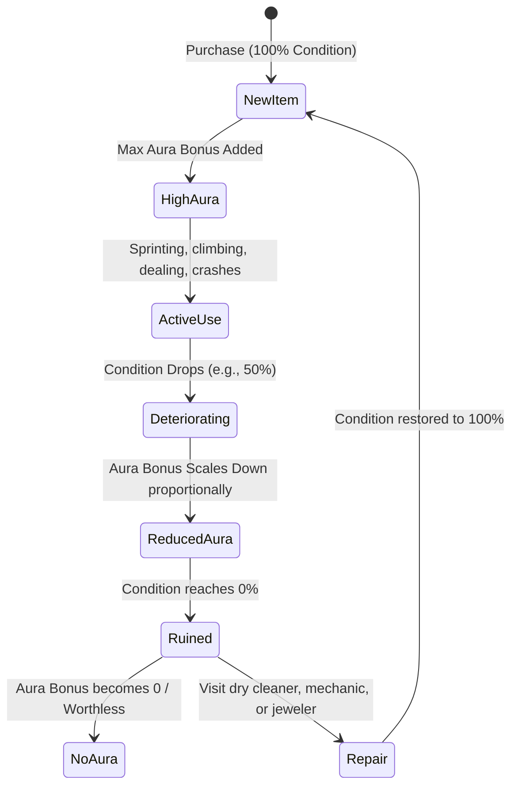

# Family Business - Player Stats System

This document outlines the core player-specific attributes, progression systems, and the relationship mechanics tied to the **Aura** stat.

---

## 👤 Core Player Stats

The player character has six primary stats that dictate their physical capabilities, progression, dealing efficiency, and social standing in the game world.

| Stat | Type | Default | Purpose | How to Modify |
| :--- | :--- | :--- | :--- | :--- |
| **Health** | Float | `100.0` | Represents the player's physical vitality. If it reaches `0.0`, the player collapses, resulting in arrest or hospitalization (losing inventory/cash). | **Decrease**: Take damage from police, rival dealers, car crashes, or falls. **Increase**: Eat food, use medical kits, or rest at home. |
| **Stamina** | Float | `100.0` | Used to perform high-energy movement like sprinting, climbing, sliding, and tumbling (handled by GASP locomotion). | **Decrease**: Sprinting, jumping, vaulting, and climbing. **Increase**: Recovers automatically over time when walking, standing still, or sitting. |
| **Aura** | Float | `0.0` | Social credit and style rating. Dictates success rates with romantic interests (girls) and general social respect. | **Decrease**: Wearing damaged/deteriorating gear, getting arrested, or failing interactions. **Increase**: Equipping high-quality clothes, jewelry, cars, and owning property. |
| **EXP** | Float | `0.0` | Experience points representing the player's overall growth. | **Increase**: Gained by completing successful deals, expanding territory, buying property, and laundering money. |
| **Level** | Integer | `1` | The player's overall rank. Used to unlock higher-tier gameplay features. | **Increase**: Reaching the EXP threshold for the current level triggers a level up, resetting the EXP bar and incrementing the level. |
| **Hustle** | Integer | `1` | Improves street-sale cash, sale EXP, and the number of customers a solicitation can attract. | **Increase**: Spend one skill point in the Player Attributes menu, up to Hustle 10. |

---

## ✨ Aura & Relationship System

The **Aura** stat functions as a gatekeeper for the game's relationship and romance system. It represents the player's swagger, style, and status.

### 1. The Relationship Gate
* The player can meet and interact with various romanceable NPCs (girls) throughout the city.
* Every girl has a minimum **Aura Requirement**. If the player's Aura is below this requirement, they will be rejected immediately.
* Higher Aura scores unlock more positive dialog options, special gifts, safe houses, and unique gameplay perks tied to relationships.

### 2. Aura Sources
Aura is not a permanent stat; it is dynamic and derived from the player's current gear and lifestyle:
* **Clothes & Suits**: Sleek streetwear or designer suits provide immediate flat Aura bonuses.
* **Jewelry & Watches**: Gold chains and luxury watches add high visual flash and Aura.
* **Vehicles**: Driving a run-down station wagon provides zero (or negative) Aura, while a low-poly sports car boosts Aura significantly.
* **Real Estate**: Owning high-end safehouses or penthouses increases the baseline Aura.

### 3. Item Deterioration & Aura Decay
To prevent the player from buying a nice suit once and maintaining high Aura forever, **Aura-boosting items deteriorate over time**:

* **Clothes**: Wear out as the player runs, slides, climbs, gets into fights, or crawls through dirty back alleys. Must be taken to the **Dry Cleaners** or replaced to restore condition.
* **Vehicles**: Loose condition when crashed, scraped, or shot. Must be taken to the **Auto Shop** to repair condition and restore Aura.
* **Jewelry**: Becomes scratched or tarnished over time. Must be taken to the **Jeweler** to polish and restore condition.

---

## 📈 Leveling & Progression

Reaching new levels through EXP accumulation represents the player's transition from a street hustler to a recognized boss.

### Level Unlocks
As the player's level increases, they gain access to higher-tier operations:
* **Level 1-5**: Street dealing only. Limited stash capacities.
* **Level 6-10**: Ability to buy basic front businesses (Laundromat, Corner Store) and hire low-level street runners.
* **Level 11-20**: Ability to buy major real estate (Clubs, Warehouses), purchase wholesale packages directly from manufacturers, and control entire city districts.
* **Level Bonuses**: Leveling up also permanently increases maximum Stamina capacity by a small margin, representing the player becoming more physically conditioned to the street life.

### Initial Prototype Rules

The first player stats implementation uses the following finalized rules:

* Base maximum Health and Stamina are both `100`.
* Health regenerates at `1` point per second after the player goes `5` seconds without taking damage.
* Stamina regenerates at `15` points per second whenever stamina is not being consumed.
* EXP required for the next level is `100 x current level`. Excess EXP carries forward, including across multiple level-ups.
* Every level awards `1` skill point and adds `2` maximum Stamina.
* Strength starts at `1` and costs `1` skill point per increase.
* Each Strength point after the first adds `10` maximum Health and `5` maximum Stamina.
* Hustle starts at `1`, costs `1` skill point per increase, and caps at `10`.
* Customer cash payout starts at `70%` over the local dealer price at Hustle 1.
* Each Hustle point after the first adds another `15%` to street-sale cash and
  EXP. The base `70%` cash markup does not apply to EXP. Reputation and Heat are
  not multiplied.
* Solicitation attracts up to `2 + (Hustle - 1)` customers, capped at `6`.
* Hustle progressively raises the chance of finding Level 2-4 customers. Level
  4 customers cannot roll at Hustle 1-4.
* One customer can reserve at most `50%` of a product stack at Hustle 1,
  scaling to `72.5%` at Hustle 10, except for the final unit.
* Maximum Health is `100 + ((Strength - 1) x 10)`.
* Maximum Stamina is `100 + ((Strength - 1) x 5) + ((Level - 1) x 2)`.
