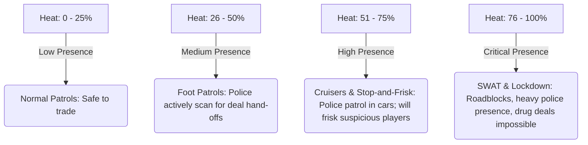

# Family Business - Territory Stats & Heat

Unlike global player attributes, **Territory Stats** are tied directly to specific city districts or neighborhoods. The player must manage their presence in each zone independently.

---

## 🗺️ Territory Stats Overview

The city is divided into multiple distinct territories (e.g., Slums, Suburbs, Downtown, Industrial Port). Each territory tracks its own local metrics:

| Stat | Range | Default | Purpose | How it is Modified |
| :--- | :--- | :--- | :--- | :--- |
| **Heat** | `0.0` to `100.0` | `0.0` | Represents police awareness and activity in this specific district. High Heat triggers police patrols, roadblocks, and search warrants. | **Increase**: Selling product, walking around with visible weapons, getting into fights, or running from local officers in this zone. **Decrease**: Automatically decays slowly when the player lays low (stops selling in this zone), or instantly by paying bribes to local crooked cops. |
| **Reputation (Rep)** | `0.0` to `100.0` | `0.0` | Represents the player's street respect and control within the territory. High Rep decreases buying prices from wholesalers, increases street customer buying prices, and secures territory loyalty. | **Increase**: Completing successful deals, defending territory from rivals, buying local properties, and spending money in local businesses. **Decrease**: Getting arrested, failing deals, letting rival dealers sell in the territory, or abandoning territory tasks. |

---

## 🚨 The Heat System

Heat is a dynamic, localized threat mechanic. High Heat in one territory does not affect other territories, encouraging the player to rotate their operations around the city to let districts "cool off."

### Heat Thresholds & Gameplay Impact

* **0% - 25% (Quiet Zone)**: Standard neighborhood vibes. Police presence is minimal. Safe to conduct manual transactions in public.
* **26% - 50% (Under Watch)**: Foot patrols are introduced. Police officers walk beats. Handing off product in their line of sight triggers immediate pursuit.
* **51% - 75% (Hot Zone)**: Police cruisers patrol the streets. Officers will perform "stop-and-frisk" checks if they see the player running, climbing, or behaving suspiciously. Carrying "Dirty Money" or product during a frisk triggers an arrest.
* **76% - 100% (Lockdown)**: SWAT units set up static checkpoints. Conducting deals is virtually impossible. The player must abandon operations in this territory or pay massive bribes to clear the heat.

---

## 🤝 Territory Reputation (Rep)

Reputation dictates the player's economic leverage and control over a neighborhood.

### 1. Pricing Dynamics
* **The Rep Premium**: As the player's Rep in a territory grows, customers respect the player more and are willing to pay higher prices for product (up to +50% profit margins).
* **Supplier Discounts**: Wholesalers operating in that territory will sell products cheaper to a highly-reputed player.

### 2. Empire Management & Automation
* **Hiring Street Runners**: To automate dealing, the player can hire NPC runners to sell product. However, runners can only be assigned to a territory if the player has at least **30% Reputation** in that zone.
* **Territory Defense**: Rival dealers will occasionally try to set up shop in your turf. If left unchecked, they will bleed your Reputation down. Confronting them (or sending hired muscle) restores control.

---

## Initial Prototype Rules

* Hood East and Hood West track Heat and Reputation independently.
* A successful sale adds the product's configured Heat and Reputation rewards
  to the territory where the customer is standing.
* Weed adds `1` Heat per gram, Coke adds `2`, and Fent adds `3`.
* Weed adds `0.15` Reputation per gram, Coke adds `0.30`, and Fent adds `0.45`.
* Heat continuously decays at `0.25` per second, including during active dealing.
* Customers refuse sales when their territory reaches `76` Heat.
* Local supplier gates are Level 1 at `0` Rep, Level 2 at `15`, Level 3 at
  `40`, Level 4 at `80`, and wholesalers at `100`.
* Locked suppliers remain visible and show their local Reputation requirement.
* Each territory provides deterministic Level 2, 3, and 4 progression dealers
  alongside its starting Level 1 dealer. Level 1 dealers stock `25-35g` Weed.

## Current Wanted Response

- Reaching `100` Heat in a territory starts a global one-star pursuit.
- One star is arrest-only. An officer must remain within `1.8m` with line of
  sight for three seconds.
- A witnessed gunshot or shooting an NPC raises the response to at least two
  stars and authorizes lethal force.
- Killing an NPC raises the response to three stars.
- Arrest or respawn clears wanted status and lowers the triggering territory
  to `25` Heat.
- Police share the pedestrian population system at roughly five officers per
  fifteen active civilians.
* Territory state is saved using the permanent `hood_east` and `hood_west` IDs.
